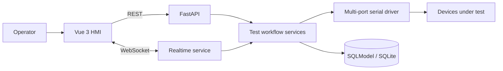

# TestHub — 电子制造生产测试系统

基于 Web 的工业上位机与生产测试系统，面向电子设备的多串口通信、AT 指令编排、批量测试和结果追溯。仓库提供脱敏后的工程实现，用于展示从设备通信到测试工作流的完整链路。

## 项目成果

在实际生产测试场景中，通过测试固件、串口协议、并行校验和失败重试，将单次硬件测试由 **60 秒缩短至 10 秒**，单线产能提升 **5 倍**，良率提升 **2.3 个百分点**。

## 核心能力

- **多串口隔离**：每个连接使用独立 `serial_id`，避免并行工位之间串台。
- **协议交互**：支持 AT 指令、十六进制原始数据、可配置终止符和自动波特率检测。
- **批量测试**：维护指令模板与预期响应，支持批量发送、异常重试和人工确认。
- **实时通信**：REST API 与 WebSocket 协同，实时推送串口响应、测试状态和错误信息。
- **结果追溯**：记录设备、工位、操作员、测试项、实际响应与通过/失败结果。
- **跨平台运行**：支持开发模式、前后端一体化生产运行和 PyInstaller 打包。

## 架构



## 技术栈

- **后端**：Python、FastAPI、Pydantic、SQLModel、pyserial、WebSocket
- **前端**：Vue 3、TypeScript、Element Plus、Pinia、Vite
- **工程化**：uv、pytest、PyInstaller

## 快速开始

### 环境要求

- Python 3.9+
- Node.js 16+
- [uv](https://docs.astral.sh/uv/)

### 开发模式

```bash
uv sync
cd frontend && npm install && cd ..
python3 start.py --dev
```

### 生产模式

```bash
cd frontend
npm run build
cd ..
python3 start.py
```

启动后可访问：

- 应用界面：`http://localhost:8000`
- OpenAPI 文档：`http://localhost:8000/docs`

## 测试

```bash
uv run pytest
```

自动化测试覆盖健康检查与基础 API 行为；涉及真实串口的场景需要连接测试设备或使用串口模拟器验证。

## 项目结构

```text
backend/app/api/       REST 与 WebSocket 接口
backend/app/drivers/   多串口通信驱动
backend/app/services/  指令、会话、测试结果与串口服务
backend/app/schemas/   API 与 WebSocket 数据模型
frontend/src/          Vue 3 操作界面、状态管理和 API 客户端
tests/                 后端自动化测试
```

## 数据安全

SQLite 数据库为本地运行时数据，不纳入版本控制。仓库不应包含真实设备标识、操作员信息、生产记录或客户数据；首次运行会按模型自动创建本地数据库。

## License

[MIT](LICENSE)
